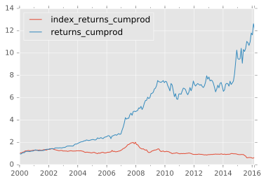
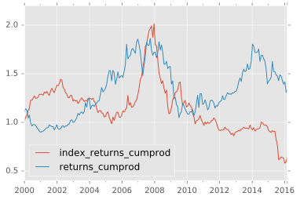
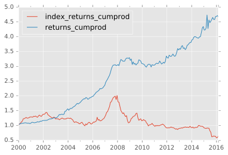

```python
import pandas
import pickle as pickle
import backtest
import numpy
import math

%matplotlib inline
import matplotlib.pyplot as plt
plt.style.use('ggplot')
%config InlineBackend.figure_format = 'svg'
```


```python
plot_data_value = pickle.load(open('temp_value/plot_data.pkl', 'rb'))
plot_data_momentum = pickle.load(open('temp_momentum/plot_data.pkl', 'rb'))
```


```python
plot_data_value[['index_returns_cumprod', 'returns_cumprod']].plot()
```


    <matplotlib.axes._subplots.AxesSubplot at 0x1135e23c8>





```python
plot_data_momentum[['index_returns_cumprod', 'returns_cumprod']].plot()
```


    <matplotlib.axes._subplots.AxesSubplot at 0x11363f400>





```python
plot_data_value
```


<div>
<table border="1" class="dataframe">
  <thead>
    <tr style="text-align: right;">
      <th></th>
      <th>returns</th>
      <th>returns_cumprod</th>
      <th>PI</th>
      <th>index_returns</th>
      <th>index_returns_cumprod</th>
      <th>returns_std</th>
      <th>returns_annualized</th>
      <th>index_returns_std</th>
      <th>index_returns_annualized</th>
      <th>sharpe</th>
      <th>index_sharpe</th>
    </tr>
  </thead>
  <tbody>
    <tr>
      <th>2000-01-03</th>
      <td>0.979119</td>
      <td>0.979119</td>
      <td>1451.900</td>
      <td>1.015698</td>
      <td>1.015698</td>
      <td>NaN</td>
      <td>NaN</td>
      <td>NaN</td>
      <td>NaN</td>
      <td>NaN</td>
      <td>NaN</td>
    </tr>
    <tr>
      <th>2000-01-31</th>
      <td>0.967204</td>
      <td>0.947008</td>
      <td>1631.524</td>
      <td>1.038764</td>
      <td>1.055071</td>
      <td>NaN</td>
      <td>NaN</td>
      <td>NaN</td>
      <td>NaN</td>
      <td>NaN</td>
      <td>NaN</td>
    </tr>
    <tr>
      <th>2000-02-28</th>
      <td>1.058206</td>
      <td>1.002130</td>
      <td>1814.783</td>
      <td>1.016995</td>
      <td>1.073002</td>
      <td>NaN</td>
      <td>NaN</td>
      <td>NaN</td>
      <td>NaN</td>
      <td>NaN</td>
      <td>NaN</td>
    </tr>
    <tr>
      <th>2000-03-27</th>
      <td>1.078670</td>
      <td>1.080968</td>
      <td>1889.534</td>
      <td>1.044498</td>
      <td>1.120748</td>
      <td>NaN</td>
      <td>NaN</td>
      <td>NaN</td>
      <td>NaN</td>
      <td>NaN</td>
      <td>NaN</td>
    </tr>
    <tr>
      <th>2000-04-24</th>
      <td>0.984312</td>
      <td>1.064009</td>
      <td>1954.889</td>
      <td>1.023339</td>
      <td>1.146905</td>
      <td>NaN</td>
      <td>NaN</td>
      <td>NaN</td>
      <td>NaN</td>
      <td>NaN</td>
      <td>NaN</td>
    </tr>
    <tr>
      <th>2000-05-22</th>
      <td>1.075314</td>
      <td>1.144144</td>
      <td>1941.130</td>
      <td>1.070551</td>
      <td>1.227821</td>
      <td>NaN</td>
      <td>NaN</td>
      <td>NaN</td>
      <td>NaN</td>
      <td>NaN</td>
      <td>NaN</td>
    </tr>
    <tr>
      <th>2000-06-19</th>
      <td>1.048154</td>
      <td>1.199240</td>
      <td>2034.282</td>
      <td>1.000981</td>
      <td>1.229025</td>
      <td>NaN</td>
      <td>NaN</td>
      <td>NaN</td>
      <td>NaN</td>
      <td>NaN</td>
      <td>NaN</td>
    </tr>
    <tr>
      <th>2000-07-17</th>
      <td>0.995412</td>
      <td>1.193738</td>
      <td>2105.201</td>
      <td>1.017316</td>
      <td>1.250307</td>
      <td>NaN</td>
      <td>NaN</td>
      <td>NaN</td>
      <td>NaN</td>
      <td>NaN</td>
      <td>NaN</td>
    </tr>
    <tr>
      <th>2000-08-14</th>
      <td>0.991949</td>
      <td>1.184128</td>
      <td>2200.368</td>
      <td>1.017257</td>
      <td>1.271884</td>
      <td>NaN</td>
      <td>NaN</td>
      <td>NaN</td>
      <td>NaN</td>
      <td>NaN</td>
      <td>NaN</td>
    </tr>
    <tr>
      <th>2000-09-11</th>
      <td>0.991781</td>
      <td>1.174396</td>
      <td>2089.886</td>
      <td>0.980332</td>
      <td>1.246868</td>
      <td>NaN</td>
      <td>NaN</td>
      <td>NaN</td>
      <td>NaN</td>
      <td>NaN</td>
      <td>NaN</td>
    </tr>
    <tr>
      <th>2000-10-09</th>
      <td>1.019756</td>
      <td>1.197597</td>
      <td>2032.076</td>
      <td>1.002819</td>
      <td>1.250383</td>
      <td>NaN</td>
      <td>NaN</td>
      <td>NaN</td>
      <td>NaN</td>
      <td>NaN</td>
      <td>NaN</td>
    </tr>
    <tr>
      <th>2000-11-06</th>
      <td>1.018885</td>
      <td>1.220213</td>
      <td>2109.290</td>
      <td>1.008608</td>
      <td>1.261146</td>
      <td>NaN</td>
      <td>NaN</td>
      <td>NaN</td>
      <td>NaN</td>
      <td>NaN</td>
      <td>NaN</td>
    </tr>
    <tr>
      <th>2000-12-04</th>
      <td>0.998352</td>
      <td>1.218202</td>
      <td>2216.103</td>
      <td>1.020205</td>
      <td>1.286627</td>
      <td>0.097146</td>
      <td>NaN</td>
      <td>0.092831</td>
      <td>NaN</td>
      <td>NaN</td>
      <td>NaN</td>
    </tr>
    <tr>
      <th>2001-01-01</th>
      <td>1.040897</td>
      <td>1.268022</td>
      <td>2192.378</td>
      <td>1.001378</td>
      <td>1.288400</td>
      <td>0.094382</td>
      <td>0.295065</td>
      <td>0.080850</td>
      <td>0.268487</td>
      <td>3.126273</td>
      <td>3.320819</td>
    </tr>
    <tr>
      <th>2001-01-29</th>
      <td>1.042722</td>
      <td>1.322195</td>
      <td>2185.196</td>
      <td>1.000000</td>
      <td>1.288400</td>
      <td>0.085517</td>
      <td>0.396182</td>
      <td>0.069028</td>
      <td>0.221151</td>
      <td>4.632790</td>
      <td>3.203774</td>
    </tr>
    <tr>
      <th>2001-02-26</th>
      <td>0.995045</td>
      <td>1.315644</td>
      <td>2067.197</td>
      <td>0.993387</td>
      <td>1.279880</td>
      <td>0.076585</td>
      <td>0.312848</td>
      <td>0.052654</td>
      <td>0.192803</td>
      <td>4.084968</td>
      <td>3.661709</td>
    </tr>
    <tr>
      <th>2001-03-26</th>
      <td>0.967475</td>
      <td>1.272853</td>
      <td>2192.069</td>
      <td>1.024878</td>
      <td>1.311720</td>
      <td>0.070242</td>
      <td>0.177512</td>
      <td>0.041385</td>
      <td>0.170398</td>
      <td>2.527165</td>
      <td>4.117411</td>
    </tr>
    <tr>
      <th>2001-04-23</th>
      <td>0.977999</td>
      <td>1.244848</td>
      <td>2247.221</td>
      <td>0.990878</td>
      <td>1.299755</td>
      <td>0.054281</td>
      <td>0.169960</td>
      <td>0.026615</td>
      <td>0.133271</td>
      <td>3.131090</td>
      <td>5.007301</td>
    </tr>
    <tr>
      <th>2001-05-21</th>
      <td>1.007807</td>
      <td>1.254567</td>
      <td>2305.680</td>
      <td>1.014719</td>
      <td>1.318887</td>
      <td>0.048514</td>
      <td>0.096511</td>
      <td>0.026961</td>
      <td>0.074169</td>
      <td>1.989359</td>
      <td>2.750985</td>
    </tr>
    <tr>
      <th>2001-06-18</th>
      <td>1.010731</td>
      <td>1.268030</td>
      <td>2261.038</td>
      <td>0.978922</td>
      <td>1.291087</td>
      <td>0.047939</td>
      <td>0.057361</td>
      <td>0.023260</td>
      <td>0.050497</td>
      <td>1.196531</td>
      <td>2.170981</td>
    </tr>
    <tr>
      <th>2001-07-16</th>
      <td>1.004061</td>
      <td>1.273179</td>
      <td>2235.154</td>
      <td>0.988463</td>
      <td>1.276191</td>
      <td>0.046437</td>
      <td>0.066548</td>
      <td>0.021510</td>
      <td>0.020702</td>
      <td>1.433063</td>
      <td>0.962417</td>
    </tr>
    <tr>
      <th>2001-08-13</th>
      <td>0.992154</td>
      <td>1.263189</td>
      <td>2044.251</td>
      <td>1.037030</td>
      <td>1.323448</td>
      <td>0.042496</td>
      <td>0.066768</td>
      <td>0.024017</td>
      <td>0.040541</td>
      <td>1.571161</td>
      <td>1.688016</td>
    </tr>
    <tr>
      <th>2001-09-10</th>
      <td>1.014044</td>
      <td>1.280929</td>
      <td>1938.065</td>
      <td>1.020855</td>
      <td>1.351048</td>
      <td>0.035747</td>
      <td>0.090713</td>
      <td>0.026942</td>
      <td>0.083554</td>
      <td>2.537622</td>
      <td>3.101288</td>
    </tr>
    <tr>
      <th>2001-10-08</th>
      <td>1.049922</td>
      <td>1.344876</td>
      <td>1803.659</td>
      <td>0.977969</td>
      <td>1.321284</td>
      <td>0.037120</td>
      <td>0.122979</td>
      <td>0.024343</td>
      <td>0.056703</td>
      <td>3.313014</td>
      <td>2.329316</td>
    </tr>
    <tr>
      <th>2001-11-05</th>
      <td>1.021515</td>
      <td>1.373810</td>
      <td>1752.199</td>
      <td>0.987585</td>
      <td>1.304880</td>
      <td>0.042963</td>
      <td>0.125877</td>
      <td>0.021394</td>
      <td>0.034678</td>
      <td>2.929928</td>
      <td>1.620893</td>
    </tr>
    <tr>
      <th>2001-12-03</th>
      <td>1.008639</td>
      <td>1.385679</td>
      <td>1837.553</td>
      <td>1.032422</td>
      <td>1.347187</td>
      <td>0.046355</td>
      <td>0.137479</td>
      <td>0.023928</td>
      <td>0.047068</td>
      <td>2.965745</td>
      <td>1.967080</td>
    </tr>
    <tr>
      <th>2001-12-31</th>
      <td>0.985522</td>
      <td>1.365617</td>
      <td>1712.541</td>
      <td>1.024645</td>
      <td>1.380389</td>
      <td>0.049006</td>
      <td>0.076966</td>
      <td>0.030416</td>
      <td>0.071397</td>
      <td>1.570535</td>
      <td>2.347357</td>
    </tr>
    <tr>
      <th>2002-01-28</th>
      <td>1.044770</td>
      <td>1.426756</td>
      <td>1418.281</td>
      <td>0.997131</td>
      <td>1.376428</td>
      <td>0.059512</td>
      <td>0.079081</td>
      <td>0.033644</td>
      <td>0.068323</td>
      <td>1.328821</td>
      <td>2.030782</td>
    </tr>
    <tr>
      <th>2002-02-25</th>
      <td>1.002544</td>
      <td>1.430385</td>
      <td>1595.979</td>
      <td>1.015826</td>
      <td>1.398211</td>
      <td>0.067850</td>
      <td>0.087213</td>
      <td>0.037204</td>
      <td>0.092455</td>
      <td>1.285386</td>
      <td>2.485107</td>
    </tr>
    <tr>
      <th>2002-03-25</th>
      <td>1.001014</td>
      <td>1.431836</td>
      <td>1748.447</td>
      <td>1.032200</td>
      <td>1.443233</td>
      <td>0.072445</td>
      <td>0.124903</td>
      <td>0.047918</td>
      <td>0.100260</td>
      <td>1.724125</td>
      <td>2.092312</td>
    </tr>
    <tr>
      <th>...</th>
      <td>...</td>
      <td>...</td>
      <td>...</td>
      <td>...</td>
      <td>...</td>
      <td>...</td>
      <td>...</td>
      <td>...</td>
      <td>...</td>
      <td>...</td>
      <td>...</td>
    </tr>
    <tr>
      <th>2013-12-16</th>
      <td>0.952955</td>
      <td>7.013105</td>
      <td>2261.862</td>
      <td>0.965414</td>
      <td>0.938993</td>
      <td>0.370816</td>
      <td>-0.085006</td>
      <td>0.019044</td>
      <td>0.051142</td>
      <td>-0.229241</td>
      <td>2.685472</td>
    </tr>
    <tr>
      <th>2014-01-13</th>
      <td>0.936973</td>
      <td>6.571090</td>
      <td>2103.066</td>
      <td>0.982271</td>
      <td>0.922345</td>
      <td>0.353868</td>
      <td>-0.163311</td>
      <td>0.017323</td>
      <td>0.020809</td>
      <td>-0.461502</td>
      <td>1.201246</td>
    </tr>
    <tr>
      <th>2014-02-10</th>
      <td>1.019430</td>
      <td>6.698766</td>
      <td>2183.225</td>
      <td>1.026136</td>
      <td>0.946452</td>
      <td>0.348584</td>
      <td>-0.107495</td>
      <td>0.015309</td>
      <td>0.045815</td>
      <td>-0.308376</td>
      <td>2.992761</td>
    </tr>
    <tr>
      <th>2014-03-10</th>
      <td>1.075169</td>
      <td>7.202308</td>
      <td>2092.751</td>
      <td>0.963263</td>
      <td>0.911682</td>
      <td>0.314022</td>
      <td>-0.049967</td>
      <td>0.016204</td>
      <td>-0.008871</td>
      <td>-0.159119</td>
      <td>-0.547465</td>
    </tr>
    <tr>
      <th>2014-04-07</th>
      <td>1.011656</td>
      <td>7.286259</td>
      <td>2155.532</td>
      <td>1.012564</td>
      <td>0.923136</td>
      <td>0.288659</td>
      <td>-0.030774</td>
      <td>0.014854</td>
      <td>0.013902</td>
      <td>-0.106611</td>
      <td>0.935890</td>
    </tr>
    <tr>
      <th>2014-05-05</th>
      <td>0.994846</td>
      <td>7.248704</td>
      <td>2122.481</td>
      <td>1.011880</td>
      <td>0.934104</td>
      <td>0.285138</td>
      <td>-0.006028</td>
      <td>0.014824</td>
      <td>0.001506</td>
      <td>-0.021140</td>
      <td>0.101576</td>
    </tr>
    <tr>
      <th>2014-06-02</th>
      <td>0.970718</td>
      <td>7.036446</td>
      <td>2135.087</td>
      <td>0.999006</td>
      <td>0.933175</td>
      <td>0.284722</td>
      <td>0.015199</td>
      <td>0.014859</td>
      <td>-0.002215</td>
      <td>0.053384</td>
      <td>-0.149076</td>
    </tr>
    <tr>
      <th>2014-06-30</th>
      <td>1.062869</td>
      <td>7.478819</td>
      <td>2144.746</td>
      <td>1.011852</td>
      <td>0.944235</td>
      <td>0.274365</td>
      <td>0.146278</td>
      <td>0.014488</td>
      <td>-0.006566</td>
      <td>0.533151</td>
      <td>-0.453190</td>
    </tr>
    <tr>
      <th>2014-07-28</th>
      <td>0.960784</td>
      <td>7.185529</td>
      <td>2280.536</td>
      <td>1.060218</td>
      <td>1.001095</td>
      <td>0.261013</td>
      <td>0.059460</td>
      <td>0.023014</td>
      <td>0.068501</td>
      <td>0.227803</td>
      <td>2.976468</td>
    </tr>
    <tr>
      <th>2014-08-25</th>
      <td>1.019674</td>
      <td>7.326899</td>
      <td>2333.800</td>
      <td>0.995476</td>
      <td>0.996565</td>
      <td>0.268163</td>
      <td>0.029122</td>
      <td>0.027611</td>
      <td>0.058179</td>
      <td>0.108598</td>
      <td>2.107082</td>
    </tr>
    <tr>
      <th>2014-09-22</th>
      <td>1.022178</td>
      <td>7.489392</td>
      <td>2397.161</td>
      <td>0.978926</td>
      <td>0.975564</td>
      <td>0.276236</td>
      <td>0.087313</td>
      <td>0.028648</td>
      <td>0.040887</td>
      <td>0.316079</td>
      <td>1.427223</td>
    </tr>
    <tr>
      <th>2014-10-20</th>
      <td>1.084931</td>
      <td>8.125471</td>
      <td>2467.345</td>
      <td>0.996070</td>
      <td>0.971730</td>
      <td>0.383432</td>
      <td>0.115067</td>
      <td>0.028923</td>
      <td>0.040772</td>
      <td>0.300097</td>
      <td>1.409707</td>
    </tr>
    <tr>
      <th>2014-11-17</th>
      <td>1.127797</td>
      <td>9.163884</td>
      <td>2590.627</td>
      <td>1.000113</td>
      <td>0.971840</td>
      <td>0.660051</td>
      <td>0.245207</td>
      <td>0.028876</td>
      <td>-0.000814</td>
      <td>0.371497</td>
      <td>-0.028206</td>
    </tr>
    <tr>
      <th>2014-12-15</th>
      <td>1.119958</td>
      <td>10.263163</td>
      <td>3093.680</td>
      <td>0.977680</td>
      <td>0.950149</td>
      <td>1.026733</td>
      <td>0.463426</td>
      <td>0.028634</td>
      <td>0.011881</td>
      <td>0.451360</td>
      <td>0.414936</td>
    </tr>
    <tr>
      <th>2015-01-12</th>
      <td>0.926069</td>
      <td>9.504399</td>
      <td>3383.836</td>
      <td>0.963768</td>
      <td>0.915723</td>
      <td>1.096642</td>
      <td>0.446396</td>
      <td>0.029267</td>
      <td>-0.007179</td>
      <td>0.407057</td>
      <td>-0.245297</td>
    </tr>
    <tr>
      <th>2015-02-09</th>
      <td>0.992730</td>
      <td>9.435297</td>
      <td>3242.713</td>
      <td>0.989360</td>
      <td>0.905980</td>
      <td>1.120271</td>
      <td>0.408513</td>
      <td>0.031932</td>
      <td>-0.042761</td>
      <td>0.364655</td>
      <td>-1.339123</td>
    </tr>
    <tr>
      <th>2015-03-09</th>
      <td>1.006890</td>
      <td>9.500309</td>
      <td>3460.377</td>
      <td>0.989814</td>
      <td>0.896752</td>
      <td>1.154865</td>
      <td>0.319065</td>
      <td>0.033605</td>
      <td>-0.016376</td>
      <td>0.276279</td>
      <td>-0.487309</td>
    </tr>
    <tr>
      <th>2015-04-06</th>
      <td>1.097377</td>
      <td>10.425417</td>
      <td>4050.095</td>
      <td>1.020477</td>
      <td>0.915115</td>
      <td>1.263243</td>
      <td>0.430833</td>
      <td>0.034162</td>
      <td>-0.008690</td>
      <td>0.341053</td>
      <td>-0.254363</td>
    </tr>
    <tr>
      <th>2015-05-04</th>
      <td>0.871777</td>
      <td>9.088635</td>
      <td>4694.551</td>
      <td>0.989558</td>
      <td>0.905559</td>
      <td>1.216527</td>
      <td>0.253829</td>
      <td>0.035937</td>
      <td>-0.030559</td>
      <td>0.208650</td>
      <td>-0.850336</td>
    </tr>
    <tr>
      <th>2015-06-01</th>
      <td>1.135340</td>
      <td>10.318694</td>
      <td>5056.188</td>
      <td>1.002926</td>
      <td>0.908208</td>
      <td>1.201624</td>
      <td>0.466464</td>
      <td>0.037258</td>
      <td>-0.026755</td>
      <td>0.388194</td>
      <td>-0.718093</td>
    </tr>
    <tr>
      <th>2015-06-29</th>
      <td>0.983081</td>
      <td>10.144109</td>
      <td>4245.469</td>
      <td>0.905302</td>
      <td>0.822202</td>
      <td>1.171538</td>
      <td>0.356378</td>
      <td>0.050078</td>
      <td>-0.129240</td>
      <td>0.304197</td>
      <td>-2.580769</td>
    </tr>
    <tr>
      <th>2015-07-27</th>
      <td>1.028204</td>
      <td>10.430217</td>
      <td>3903.456</td>
      <td>0.933252</td>
      <td>0.767322</td>
      <td>1.077365</td>
      <td>0.451559</td>
      <td>0.063882</td>
      <td>-0.233517</td>
      <td>0.419133</td>
      <td>-3.655432</td>
    </tr>
    <tr>
      <th>2015-08-24</th>
      <td>1.059144</td>
      <td>11.047103</td>
      <td>3362.830</td>
      <td>0.803710</td>
      <td>0.616705</td>
      <td>0.993412</td>
      <td>0.507746</td>
      <td>0.100270</td>
      <td>-0.381170</td>
      <td>0.511113</td>
      <td>-3.801427</td>
    </tr>
    <tr>
      <th>2015-09-21</th>
      <td>0.988964</td>
      <td>10.925190</td>
      <td>3306.421</td>
      <td>1.013193</td>
      <td>0.624841</td>
      <td>0.824818</td>
      <td>0.458755</td>
      <td>0.119594</td>
      <td>-0.359508</td>
      <td>0.556190</td>
      <td>-3.006083</td>
    </tr>
    <tr>
      <th>2015-10-19</th>
      <td>0.977994</td>
      <td>10.684770</td>
      <td>3547.078</td>
      <td>1.030107</td>
      <td>0.643653</td>
      <td>0.661825</td>
      <td>0.314972</td>
      <td>0.128218</td>
      <td>-0.337621</td>
      <td>0.475915</td>
      <td>-2.633192</td>
    </tr>
    <tr>
      <th>2015-11-16</th>
      <td>1.030112</td>
      <td>11.006510</td>
      <td>3777.327</td>
      <td>0.988974</td>
      <td>0.636556</td>
      <td>0.648393</td>
      <td>0.201075</td>
      <td>0.131884</td>
      <td>-0.344999</td>
      <td>0.310112</td>
      <td>-2.615938</td>
    </tr>
    <tr>
      <th>2015-12-14</th>
      <td>1.071193</td>
      <td>11.790092</td>
      <td>3685.935</td>
      <td>0.995301</td>
      <td>0.633565</td>
      <td>0.782581</td>
      <td>0.148778</td>
      <td>0.132748</td>
      <td>-0.333195</td>
      <td>0.190112</td>
      <td>-2.509985</td>
    </tr>
    <tr>
      <th>2016-01-11</th>
      <td>0.986475</td>
      <td>11.630636</td>
      <td>3157.712</td>
      <td>0.915271</td>
      <td>0.579883</td>
      <td>0.816902</td>
      <td>0.223711</td>
      <td>0.137571</td>
      <td>-0.366749</td>
      <td>0.273853</td>
      <td>-2.665888</td>
    </tr>
    <tr>
      <th>2016-02-08</th>
      <td>1.085485</td>
      <td>12.624886</td>
      <td>2891.622</td>
      <td>1.027701</td>
      <td>0.595947</td>
      <td>0.941752</td>
      <td>0.338049</td>
      <td>0.136684</td>
      <td>-0.342208</td>
      <td>0.358957</td>
      <td>-2.503643</td>
    </tr>
    <tr>
      <th>2016-03-07</th>
      <td>0.961977</td>
      <td>12.144849</td>
      <td>3032.193</td>
      <td>1.077997</td>
      <td>0.642428</td>
      <td>0.937326</td>
      <td>0.278364</td>
      <td>0.129512</td>
      <td>-0.283605</td>
      <td>0.296976</td>
      <td>-2.189799</td>
    </tr>
  </tbody>
</table>
<p>212 rows × 11 columns</p>
</div>


```python
holding_period = 4

plot_data_combined = pandas.DataFrame()
plot_data_combined.index = plot_data_combined.index
plot_data_combined['returns'] = 0.5 * plot_data_value['returns'] + 0.5 * plot_data_momentum['returns']
plot_data_combined['returns_cumprod'] = plot_data_combined['returns'].cumprod()
plot_data_combined[['PI', 'index_returns', 'index_returns_cumprod']] = plot_data_value[['PI', 'index_returns', 'index_returns_cumprod']]
plot_data_combined['returns_std'] = plot_data_combined['returns_cumprod'].rolling(window=int(52/holding_period), min_periods=int(52/holding_period)).std()
plot_data_combined['returns_annualized'] = (plot_data_combined['returns_cumprod'] - plot_data_combined['returns_cumprod'].shift(int(52/holding_period))) / plot_data_combined['returns_cumprod'].shift(int(52/holding_period))
plot_data_combined[['index_returns_std', 'index_returns_annualized']] = plot_data_value[['index_returns_std', 'index_returns_annualized']]
plot_data_combined['sharpe'] = plot_data_combined['returns_annualized'] / plot_data_combined['returns_std']
plot_data_combined['index_sharpe'] = plot_data_value['index_sharpe']

pickle.dump(plot_data_combined, open('temp_combined/plot_data.pkl', 'wb'))

plot_data_combined.to_csv('results/combined_shanghai_plot_data.csv')
plot_data_combined[['index_returns_cumprod', 'returns_cumprod']].plot()
```


    <matplotlib.axes._subplots.AxesSubplot at 0x1132b0278>





```python
plot_data_value['returns'].corr(plot_data_momentum['returns'])
```


    -0.56781402325127195


```python
YEARS = [plot_data_combined.index.asof('%d-01-01' % year) for year in range(2001, 2017)]
returns_years = [plot_data_combined['returns_annualized'].loc[year] for year in YEARS]
sd_years = [plot_data_combined['returns_std'].loc[year] for year in YEARS]
sharpe_years = [plot_data_combined['sharpe'].loc[year] for year in YEARS]
index_returns_years = [plot_data_combined['index_returns_annualized'].loc[year] for year in YEARS]
index_sd_years = [plot_data_combined['index_returns_std'].loc[year] for year in YEARS]
index_sharpe_years = [plot_data_combined['index_sharpe'].loc[year] for year in YEARS]

summary = pandas.DataFrame({'years': list(range(2001, 2017)), 'factor_returns': returns_years, 'factor_sd': sd_years, 'factor_sharpe': sharpe_years, 'index_returns': index_returns_years, 'index_sd': index_sd_years, 'index_sharpe': index_sharpe_years})
summary = summary.set_index('years')
summary.to_csv('results/combined_shanghai_summary.csv')
```
