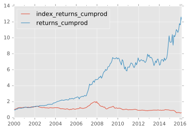

```python
import pandas
import pickle as pickle
import backtest
import numpy
import math

%matplotlib inline
import matplotlib.pyplot as plt
plt.style.use('ggplot')
%config InlineBackend.figure_format = 'svg'
```


```python
# index data
chsashr_pi = pandas.read_csv('csvs/index_chsashr.csv')
chsashr_pi['dates'] = chsashr_pi['Unnamed: 0']
chsashr_pi = chsashr_pi.set_index('dates')
chsashr_pi = chsashr_pi.drop('Unnamed: 0', 1)
chsashr_pi['index_returns'] = chsashr_pi['PI'].pct_change()
chsashr_pi['index_returns'] = chsashr_pi['index_returns'] + 1

chzashr_pi = pandas.read_csv('csvs/index_chzashr.csv')
chzashr_pi['dates'] = chzashr_pi['Unnamed: 0']
chzashr_pi = chzashr_pi.set_index('dates')
chzashr_pi = chzashr_pi.drop('Unnamed: 0', 1)
chzashr_pi['index_returns'] = chzashr_pi['PI'].pct_change()
chzashr_pi['index_returns'] = chzashr_pi['index_returns'] + 1
```


```python
df_sh = pickle.load(open('temp_value/df_sh.pkl', 'rb'))
date_sh = pickle.load(open('temp_value/date_sh.pkl', 'rb'))
dates = pickle.load(open('temp_value/dates.pkl', 'rb'))
universes = pickle.load(open('temp_value/universes_sh.pkl', 'rb'))
signals_value_sh = pickle.load(open('temp_value/signals_value_sh.pkl', 'rb'))

# df_sh = pickle.load(open('temp_momentum/df_sh.pkl', 'rb'))
# date_sh = pickle.load(open('temp_momentum/date_sh.pkl', 'rb'))
# dates = pickle.load(open('temp_momentum/dates.pkl', 'rb'))
# universes = pickle.load(open('temp_momentum/universes_sh.pkl', 'rb'))
# signals_value_sh = pickle.load(open('temp_momentum/signals_momentum_sh.pkl', 'rb'))
```


```python
period_returns = []
dates_used = []

holding_period = 4

for i in range(0, len(dates) - holding_period, holding_period):
    date_t0 = dates[i]
    date_t1 = dates[i + holding_period]
    period_return = backtest.period_return(signals_value_sh[i], df_sh, date_t0, date_t1)
    period_returns.append(period_return)
    dates_used.append(date_t0)

pickle.dump(period_returns, open('temp_value/period_returns_sh.pkl', 'wb'))
```


```python
period_returns_sh = pickle.load(open('temp_value/period_returns_sh.pkl', 'rb'))
plot_data = pandas.DataFrame({'returns': period_returns_sh, 'dates': dates_used})
plot_data['dates'] = pandas.to_datetime(plot_data['dates'])
plot_data = plot_data.set_index('dates')
plot_data['returns'] = plot_data['returns'] + 1
plot_data['returns_cumprod'] = plot_data['returns'].cumprod()
plot_data = plot_data.merge(chsashr_pi, left_index=True, right_index=True)
plot_data['index_returns_cumprod'] = plot_data['index_returns'].cumprod()
plot_data['returns_std'] = plot_data['returns_cumprod'].rolling(window=int(52/holding_period), min_periods=int(52/holding_period)).std()
plot_data['returns_annualized'] = (plot_data['returns_cumprod'] - plot_data['returns_cumprod'].shift(int(52/holding_period))) / plot_data['returns_cumprod'].shift(int(52/holding_period))
plot_data['index_returns_std'] = plot_data['index_returns_cumprod'].rolling(window=int(52/holding_period), min_periods=int(52/holding_period)).std()
plot_data['index_returns_annualized'] = (plot_data['index_returns_cumprod'] - plot_data['index_returns_cumprod'].shift(int(52/holding_period))) / plot_data['index_returns_cumprod'].shift(int(52/holding_period))
plot_data['sharpe'] = plot_data['returns_annualized'] / plot_data['returns_std']
plot_data['index_sharpe'] = plot_data['index_returns_annualized'] / plot_data['index_returns_std']

pickle.dump(plot_data, open('temp_value/plot_data.pkl', 'wb'))

plot_data.to_csv('results/value_shanghai_plot_data.csv')
plot_data[['index_returns_cumprod', 'returns_cumprod']].plot()
```


    <matplotlib.axes._subplots.AxesSubplot at 0x1151ef550>





```python
YEARS = [plot_data.index.asof('%d-01-01' % year) for year in range(2001, 2017)]
returns_years = [plot_data['returns_annualized'].loc[year] for year in YEARS]
sd_years = [plot_data['returns_std'].loc[year] for year in YEARS]
sharpe_years = [plot_data['sharpe'].loc[year] for year in YEARS]
index_returns_years = [plot_data['index_returns_annualized'].loc[year] for year in YEARS]
index_sd_years = [plot_data['index_returns_std'].loc[year] for year in YEARS]
index_sharpe_years = [plot_data['index_sharpe'].loc[year] for year in YEARS]

summary = pandas.DataFrame({'years': list(range(2001, 2017)), 'factor_returns': returns_years, 'factor_sd': sd_years, 'factor_sharpe': sharpe_years, 'index_returns': index_returns_years, 'index_sd': index_sd_years, 'index_sharpe': index_sharpe_years})
summary = summary.set_index('years')
summary.to_csv('results/value_shanghai_summary.csv')
```
